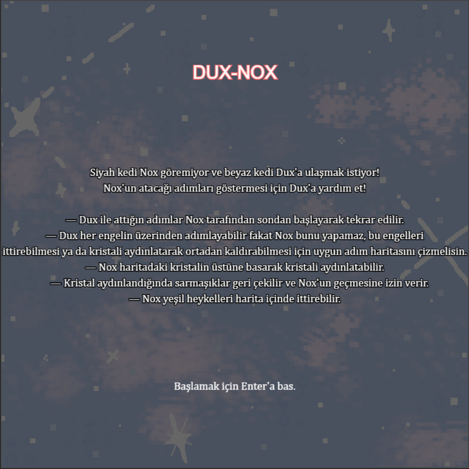

# DUX-NOX
DUX-NOX HTML5, Canvas ve Javascript kullanılarak geliştirilmiş uyarlama bir puzzle oyunudur. Oyun WASD ya da yön tuşları ile oynanır. Oyun içinde oyuncu tarafından kontrol edilen ve edilemeyen olmak üzere iki karakter vardır. Amaç, uygun bir yol haritası üzerinden bir karakteri diğerine ulaştırmaktır.
## Oyun Başlama Ekranı
Başlama ekranında oyun amacı açıklanır, mekanikler ve kontroller kısaca anlatılır. Başlamak için Enter'a basılır.

----
## Oynanış
- Oyun içindeki beyaz renkli karakter (Dux) oyuncuya aittir. Oyuncu WASD veya yön tuşlarıyla karakterini kontrol eder.
- Dux'ın seviye boyunca attığı adımlar kaydedilir. Dux, haritanın altındaki siyah renkli Nox karakterine ulaştığı zaman hareketi engellenir.
- Oyunda heykel ve sarmaşık olmak üzere iki engel tipi vardır. Dux engellerin hiçbirine takılmadan geçebilir. Nox ise heykelleri ittirebilirken, sarmaşıkları geçmek için önce kristalin üzerine basarak onu aydınlatmak zorundadır.
- Dux, Nox'a ulaştığı zaman Nox kaydedilen adım haritasını sondan takip eder. Eğer tüm adım haritasını tamamlayabilirse seviye geçilir.

[DUX-NOX oyna](https://ecemino.github.io/my-game/)

[Orijinal Oyun Sayfası](https://elvinlc.itch.io/dux-nox)

#### Asset Kaynakça Siteleri
[Arka Plan Müziği: First Steps - Lena Raine](https://archive.org/download/official-celeste-original-soundtrack-06-checking-in)
[Adım Atma Sesi](https://soundeffectgenerator.org/en/sound-effects/hop-sound-effect)
